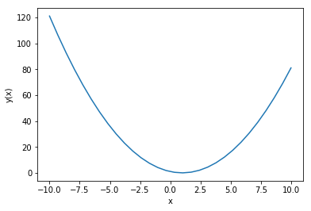
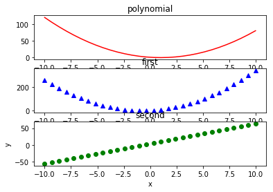
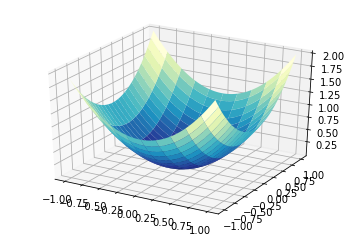
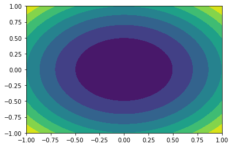

## nose


```python
from numpy.testing.decorators import setastest,skipif,knownfailureif
from numpy.testing import decorate_methods
@setastest(False)
def test_false():
    pass

@setastest(True)
def test_true():
    pass

@skipif(True)
def test_skip():
    pass

@knownfailureif(True)
def test_alawaysfail():
    pass

class TestClass():
    def test_true2(self):
        pass
    
class TestClass2():
    def test_alse2(self):
        pass

decorate_methods(TestClass2,setastest(False),'test_false2')
```

#  matplot 绘图


```python
import numpy as np
import matplotlib.pyplot as plt

func=np.poly1d(np.array([1,-2,1]).astype(float))
x=np.linspace(-10,10,30)
y=func(x)

plt.plot(x,y)
plt.xlabel("x")
plt.ylabel("y(x)")
plt.show()
```





np.poly1d(array)创建多项式系数
np.linspace(a,b,n)在ab间产生n个均匀分布的数值
plt.xlabel("name")横坐标标签
多项式对象的 deriv(m=n) 计算多项式函数的微分,m为阶数
           integ() 计算多项式函数的积分
           roots() 计算多项式的根
           ploy() 将多项式的根转化为系数


```python
import numpy as np
import matplotlib.pyplot as plt

func=np.poly1d(np.array([1,2,3,4]).astype(float))
x=np.linspace(-10,10,30)
func1=func.deriv(m=1)
y1=func1(x)
func2=func.deriv(m=2)
y2=func2(x)
plt.subplot(311)
plt.plot(x,y,'r-')
plt.title('polynomial')

plt.subplot(312)
plt.plot(x,y1,'b^')
plt.title('first')

plt.subplot(313)
plt.plot(x,y2,'go')
plt.title('second')

plt.xlabel('x')
plt.ylabel('y')

plt.show()

```





### 绘制子函数
matplotlib.pyplot.subplot(number) 设置子函数图像
matplotlib.pyplot.title('') 设置图像标题
fig=matplotlib.pyplot.figure() 创建一个图像对象
ax=fig.add_subplot()添加一个子图
ax.xaxis.set_major_locator() x轴主定位器 粗的轴
ax.xaxis.set_minor_locator() x轴次定位器 细的轴
ax.xaxis.set_major_formatter() x轴主定位器的格式化
matplotlib.finance.candlestick(ax,数据) 绘制k图的函数工具
fig.autofmt_xdate() 使标签适应x轴的长度


```python
from matplotlib.dates import DateFormatter,DayLocator,MonthLocator
from matplotlib.finance import quotes_historical_yahoo_ochl,candlestick_ochl
from datetime import date
import matplotlib.pyplot as plt
import sys

today =date.today()
start=(today.year-1,today.month,today.day)

print(today)
print(start)
 
alldays=DayLocator()
months=MonthLocator()
month_formatter=DateFormatter("%b %Y")

symbol="DISH"

#这里存在问题，需要解决！！！！！！！#
if len(sys.argv)==2:
    symbol=sys.argv[1]
    
quotes=quotes_historical_yahoo_ochl(symbol,start,(today.year,today.month,today.day))

print(quotes)

fig=plt.figure()
ax=fig.add_subplot(111)
ax.xaxis.set_major_locator(months)
ax.xaxis.set_minor_locator(alldays)
ax.xaxis.set_major_formatter(month_formatter)

candlestick_ochl(ax,quotes)
fig.autofmt_xdate()
plt.show()

```

    2018-01-19
    (2017, 1, 19)


    ---------------------------------------------------------------------------

    gaierror                                  Traceback (most recent call last)

    /usr/local/Cellar/python3/3.6.4/Frameworks/Python.framework/Versions/3.6/lib/python3.6/urllib/request.py in do_open(self, http_class, req, **http_conn_args)
       1317                 h.request(req.get_method(), req.selector, req.data, headers,
    -> 1318                           encode_chunked=req.has_header('Transfer-encoding'))
       1319             except OSError as err: # timeout error


    /usr/local/Cellar/python3/3.6.4/Frameworks/Python.framework/Versions/3.6/lib/python3.6/http/client.py in request(self, method, url, body, headers, encode_chunked)
       1238         """Send a complete request to the server."""
    -> 1239         self._send_request(method, url, body, headers, encode_chunked)
       1240 


    /usr/local/Cellar/python3/3.6.4/Frameworks/Python.framework/Versions/3.6/lib/python3.6/http/client.py in _send_request(self, method, url, body, headers, encode_chunked)
       1284             body = _encode(body, 'body')
    -> 1285         self.endheaders(body, encode_chunked=encode_chunked)
       1286 


    /usr/local/Cellar/python3/3.6.4/Frameworks/Python.framework/Versions/3.6/lib/python3.6/http/client.py in endheaders(self, message_body, encode_chunked)
       1233             raise CannotSendHeader()
    -> 1234         self._send_output(message_body, encode_chunked=encode_chunked)
       1235 


    /usr/local/Cellar/python3/3.6.4/Frameworks/Python.framework/Versions/3.6/lib/python3.6/http/client.py in _send_output(self, message_body, encode_chunked)
       1025         del self._buffer[:]
    -> 1026         self.send(msg)
       1027 


    /usr/local/Cellar/python3/3.6.4/Frameworks/Python.framework/Versions/3.6/lib/python3.6/http/client.py in send(self, data)
        963             if self.auto_open:
    --> 964                 self.connect()
        965             else:


    /usr/local/Cellar/python3/3.6.4/Frameworks/Python.framework/Versions/3.6/lib/python3.6/http/client.py in connect(self)
        935         self.sock = self._create_connection(
    --> 936             (self.host,self.port), self.timeout, self.source_address)
        937         self.sock.setsockopt(socket.IPPROTO_TCP, socket.TCP_NODELAY, 1)


    /usr/local/Cellar/python3/3.6.4/Frameworks/Python.framework/Versions/3.6/lib/python3.6/socket.py in create_connection(address, timeout, source_address)
        703     err = None
    --> 704     for res in getaddrinfo(host, port, 0, SOCK_STREAM):
        705         af, socktype, proto, canonname, sa = res


    /usr/local/Cellar/python3/3.6.4/Frameworks/Python.framework/Versions/3.6/lib/python3.6/socket.py in getaddrinfo(host, port, family, type, proto, flags)
        744     addrlist = []
    --> 745     for res in _socket.getaddrinfo(host, port, family, type, proto, flags):
        746         af, socktype, proto, canonname, sa = res


    gaierror: [Errno 8] nodename nor servname provided, or not known

    
    During handling of the above exception, another exception occurred:


    URLError                                  Traceback (most recent call last)

    <ipython-input-23-062673a97d5f> in <module>()
         21     symbol=sys.argv[1]
         22 
    ---> 23 quotes=quotes_historical_yahoo_ochl(symbol,start,(today.year,today.month,today.day))
         24 
         25 print(quotes)


    /usr/local/lib/python3.6/site-packages/matplotlib/finance.py in quotes_historical_yahoo_ochl(ticker, date1, date2, asobject, adjusted, cachename)
        409     return _quotes_historical_yahoo(ticker, date1, date2, asobject=asobject,
        410                              adjusted=adjusted, cachename=cachename,
    --> 411                              ochl=True)
        412 
        413 


    /usr/local/lib/python3.6/site-packages/matplotlib/finance.py in _quotes_historical_yahoo(ticker, date1, date2, asobject, adjusted, cachename, ochl)
        499     #    warnings.warn("Recommend changing to asobject=None")
        500 
    --> 501     fh = fetch_historical_yahoo(ticker, date1, date2, cachename)
        502 
        503     try:


    /usr/local/lib/python3.6/site-packages/matplotlib/finance.py in fetch_historical_yahoo(ticker, date1, date2, cachename, dividends)
        358         else:
        359             mkdirs(os.path.abspath(os.path.dirname(cachename)))
    --> 360             with contextlib.closing(urlopen(url)) as urlfh:
        361                 with open(cachename, 'wb') as fh:
        362                     fh.write(urlfh.read())


    /usr/local/Cellar/python3/3.6.4/Frameworks/Python.framework/Versions/3.6/lib/python3.6/urllib/request.py in urlopen(url, data, timeout, cafile, capath, cadefault, context)
        221     else:
        222         opener = _opener
    --> 223     return opener.open(url, data, timeout)
        224 
        225 def install_opener(opener):


    /usr/local/Cellar/python3/3.6.4/Frameworks/Python.framework/Versions/3.6/lib/python3.6/urllib/request.py in open(self, fullurl, data, timeout)
        524             req = meth(req)
        525 
    --> 526         response = self._open(req, data)
        527 
        528         # post-process response


    /usr/local/Cellar/python3/3.6.4/Frameworks/Python.framework/Versions/3.6/lib/python3.6/urllib/request.py in _open(self, req, data)
        542         protocol = req.type
        543         result = self._call_chain(self.handle_open, protocol, protocol +
    --> 544                                   '_open', req)
        545         if result:
        546             return result


    /usr/local/Cellar/python3/3.6.4/Frameworks/Python.framework/Versions/3.6/lib/python3.6/urllib/request.py in _call_chain(self, chain, kind, meth_name, *args)
        502         for handler in handlers:
        503             func = getattr(handler, meth_name)
    --> 504             result = func(*args)
        505             if result is not None:
        506                 return result


    /usr/local/Cellar/python3/3.6.4/Frameworks/Python.framework/Versions/3.6/lib/python3.6/urllib/request.py in http_open(self, req)
       1344 
       1345     def http_open(self, req):
    -> 1346         return self.do_open(http.client.HTTPConnection, req)
       1347 
       1348     http_request = AbstractHTTPHandler.do_request_


    /usr/local/Cellar/python3/3.6.4/Frameworks/Python.framework/Versions/3.6/lib/python3.6/urllib/request.py in do_open(self, http_class, req, **http_conn_args)
       1318                           encode_chunked=req.has_header('Transfer-encoding'))
       1319             except OSError as err: # timeout error
    -> 1320                 raise URLError(err)
       1321             r = h.getresponse()
       1322         except:


    URLError: <urlopen error [Errno 8] nodename nor servname provided, or not known>


```python
from mpl_toolkits.mplot3d import Axes3D
import matplotlib.pyplot as plt
import numpy as np
from matplotlib import cm

fig=plt.figure()
ax=fig.add_subplot(111,projection='3d')
u=np.linspace(-1,1,100)
x,y=np.meshgrid(u,u)
z=x**2 +y**2
ax.plot_surface(x,y,z,rstride=4,cmap=cm.YlGnBu_r)
plt.show()
```





np.meshgrid()用于处理数据的矢量化处理
比如两个一维数组，生成二维数组 的计算。
plot_surface() 生成面图
contourf( ) 生成等高线


```python
from mpl_toolkits.mplot3d import Axes3D
import matplotlib.pyplot as plt
import numpy as np
from matplotlib import cm

fig=plt.figure()
ax=fig.add_subplot(111)
u=np.linspace(-1,1,100)
x,y=np.meshgrid(u,u)
z=x**2 +y**2
ax.contourf(x,y,z)
plt.show()
```




