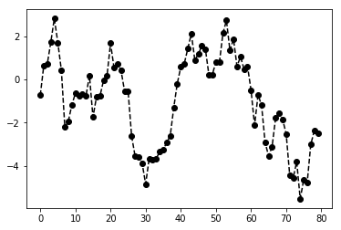
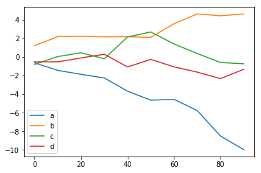
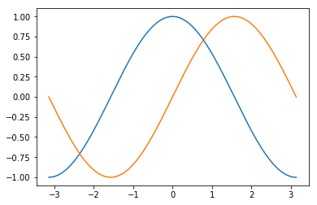

# pandas#


```python
import pandas as pd
a=pd.Series([1,-2,3,0])
a.rank()
```


    0    3.0
    1    1.0
    2    4.0
    3    2.0
    dtype: float64


```python
import matplotlib.pyplot as plt
from numpy.random import randn

fig=plt.plot(randn(80).cumsum(),'ko--')
fig
```


    [<matplotlib.lines.Line2D at 0x10dff1748>]





```python
from pandas import Series,DataFrame
import numpy as np
df=DataFrame(np.random.randn(10,4).cumsum(0),columns=['a','b','c','d'],index=np.arange(0,100,10))
df.plot()
```


    <matplotlib.axes._subplots.AxesSubplot at 0x10df145c0>





```python
from matplotlib.pyplot import plot,show
import numpy as np
x,y,z = np.mgrid[-3:3:100j,-1:1:100j,-3:3:100j]
f=(x**2 + 9.0/4*y**2 + z**2 -1)**3 - x**2 * z**3 -9.0/80 * y**2 * z**3
contour=plot.contour3d(x,y,z,f,contours=[0],color=(1,0,0)) 
show()
```


    ---------------------------------------------------------------------------

    AttributeError                            Traceback (most recent call last)

    <ipython-input-2-46149cd9ebdc> in <module>()
          3 x,y,z = np.mgrid[-3:3:100j,-1:1:100j,-3:3:100j]
          4 f=(x**2 + 9.0/4*y**2 + z**2 -1)**3 - x**2 * z**3 -9.0/80 * y**2 * z**3
    ----> 5 contour=plot.contour3d(x,y,z,f,contours=[0],color=(1,0,0))
          6 show()


    AttributeError: 'function' object has no attribute 'contour3d'


```python
from pylab import *
import numpy as np

X=np.linspace(-np.pi,np.pi,256,endpoint=True)
C,S=np.cos(X),np.sin(X)

plot(X,C)
plot(X,S)

show()
```





```python
import pandas as pd

df= pd.DataFrame([[1,2],[3,4],[5,6],[7,8]],index=['a','b','c','d'],columns=['sim','dog'])
df
df.sum()
df.sum(axis=1)
```


    a     3
    b     7
    c    11
    d    15
    dtype: int64


DataFrame的sum方法会返回一个含有列小计的Series
传入axis=1,会按行来进行统计，其中NA会被自动排除，属性 skipna =True 表示忽略，False为识别na。
df.idmax() 返回列的最大值
df.cumsum() 累计型统计
df.describe() 用于一次性返回多个汇总结果

Series.isin 计算series中是否包含传入的值序列中的布尔值
series.unique 计算series中的唯一值数值，按发现的顺序返回
series.value_counts 返回一个series，其索引为唯一值，其值为频率，按计数值降序排列

series的dropna返回一个仅含有非空数据和索引值的series
也可以用data[data.notnull()]来实现
how='all'表示丢弃那些全为NA的行，如果增加参数axis=1,会删除全为na的列

# 数据填充

df.fillna(0) 自动填充na数据
若为 df.fillna({字典})，则为填充不同的列
df.dillna(method='ffill')表示填充方式，数值和所在列的最后一个数值相同
属性：axis 0默认，行；若为1，则为列
    inplace boolean值，true为不产生新的对象，false为产生新的对象，默认false

# 层次化索引


```python
import pandas as pd
import numpy as np
data=pd.Series(np.random.random(10),index=[['a','a','a','b','b','b','c','c','d','d'],[1,2,3,1,2,3,1,2,2,3]]
    )
data
data.index
data['a':'b']
data[:,2]
```


    a    0.006424
    b    0.533939
    c    0.788994
    d    0.168317
    dtype: float64


层次化索引 
data['索引名']
data[索引名 :索引名]
data.unstack() 将两层index重新生成一个dataframe
data.unstack().stack() unstack方法的逆方法

# 数据加载、储存、文件格式

read_csv:默认分隔符号为逗号
read_table:默认分隔符号为“\t”
read_fwf:读取定宽格式数据 没有分隔符号
read_clipboard:读取剪切板中的数据，可以看做read_table的剪贴板版。在网页转化成表格时很有用

## 属性
    read_csv  header=None,默认自动添加列名
              names=['',''] 自定义列名
              index_col='' 表示自定义索引列的名称
              na_values=[''] 自定义替换na的字符串
              nrows=n 逐块读取文件，定义读取到多少行
              chunksize=1000 设置要读取得数据的行数
              
    dataframe 数据可以通过 to_csv方法，写到一个以逗号分隔的文件中。
    dataframe.to_csv(sys.stdout,sep="符号") sep定义分隔符号，sys.std.stdout仅打印结果；缺失的数据会保存成空字符串，用na_rep='定义值'替换空字符串
            属性：index=false,headers=false禁用行列标签
                 cols=['','',''] 自定义列名
                 
### series 也有to_csv("名称")方法


```python
import json

obj="""
{"name":"gwx",
 "places_lived":["USA","Spain","Germany"],
 "siblings":[{"name":"ggg","age":12},
     {"name":"www","age":18}]
}
"""
result=json.loads(obj)

result

asjson=json.dumps(result)
asjson
```


    '{"name": "gwx", "places_lived": ["USA", "Spain", "Germany"], "siblings": [{"name": "ggg", "age": 12}, {"name": "www", "age": 18}]}'


## json数据

json.loads(str) 将json字符串转换成python对象
json.dumps(pyobj) 将python对象转换为json格式

# XML和HTML:web信息收集


```python
from lxml.html import parse
from urllib.request import urlopen
#使用lxml之前确保HTML经过utf-8解码，即：code=html.decode('utf-8','ignore')
parsed=parse(urlopen("http://www.baidu.com"))
doc=parsed.getroot()
links=doc.findall('.//a')
links[15].get('href')
links[16].text_content()
i=0
for link in links:
    i+=1
    print(str(i)+":",link.get("href"))    
    
```

    1: /
    2: javascript:;
    3: javascript:;
    4: javascript:;
    5: /
    6: javascript:;
    7: https://passport.baidu.com/v2/?login&tpl=mn&u=http%3A%2F%2Fwww.baidu.com%2F&sms=5
    8: http://news.baidu.com
    9: http://www.hao123.com
    10: http://map.baidu.com
    11: http://v.baidu.com
    12: http://tieba.baidu.com
    13: http://xueshu.baidu.com
    14: https://passport.baidu.com/v2/?login&tpl=mn&u=http%3A%2F%2Fwww.baidu.com%2F&sms=5
    15: http://www.baidu.com/gaoji/preferences.html
    16: http://www.baidu.com/more/
    17: http://news.baidu.com/ns?cl=2&rn=20&tn=news&word=
    18: http://tieba.baidu.com/f?kw=&fr=wwwt
    19: http://zhidao.baidu.com/q?ct=17&pn=0&tn=ikaslist&rn=10&word=&fr=wwwt
    20: http://music.baidu.com/search?fr=ps&ie=utf-8&key=
    21: http://image.baidu.com/search/index?tn=baiduimage&ps=1&ct=201326592&lm=-1&cl=2&nc=1&ie=utf-8&word=
    22: http://v.baidu.com/v?ct=301989888&rn=20&pn=0&db=0&s=25&ie=utf-8&word=
    23: http://map.baidu.com/m?word=&fr=ps01000
    24: http://wenku.baidu.com/search?word=&lm=0&od=0&ie=utf-8
    25: //www.baidu.com/more/
    26: //www.baidu.com/cache/sethelp/help.html
    27: http://home.baidu.com
    28: http://ir.baidu.com
    29: http://e.baidu.com/?refer=888
    30: http://www.baidu.com/duty/
    31: http://jianyi.baidu.com/
    32: http://www.beian.gov.cn/portal/registerSystemInfo?recordcode=11000002000001


1.urllib.request as request 请求
        a=request.urlopen("http://&&*()")
        a.read()
        
2.urllib.parse as parse 发送数据
        url=""
        value={
        "":"",
        "":"",
        "":""
        }
        b=parse.urlencode(value)
        req=request.Request(url,b)
        req.add_header("Referer","http:///KVHBKJKLN")
        response=request.urlopen(req)
        response.read().decode("utf8")
        
3.urllib.socket
        

# 数据处理

## 二进制数据格式
df=pd.read_csv("**.csv") 读取数据
df.save("**.csv") 储存数据
pd.load("**/frame_pickle") 回读数据，且pickle函数用于短期储存数据格式。

## 使用HDF5格式
data=pd.HDFStore("**.h5")
data['obj']=frame
store['obj_col']=frame['a']

## 读取Excel
data = pd.ExcelFile("**.xls")
table=data.parse('sheet1')  //将表中的数据读取到DataFrame中

# 数据库连接

## nosql
菲关系型数据库，用于超大规模的数据储存。这种类型的数据存储不需要固定的模式，无需多余的操作就可以横向扩展。
## mongodb
基于分布式文件储存的开源数据库系统。面向文档储存的数据库，操作起来比较简单和容易。
# (未完待续)

# 数据规整化：清理、转换、合并、重塑
pd.merge(data1[dataframe],data2,how="outer",on="键值") outer包含，并集，能取到NA，若how=inner,则表示为去掉Na所在的行


```python
import numpy as np
import pandas as pd
arr=np.arange(12).reshape((3,4))
arr
np.concatenate([arr,arr],axis=1)
#pd.concat([series,series]) 合并两个一维数组
data=pd.DataFrame(np.arange(6).reshape((2,3)))
pd.concat([data,data],axis=1)
```


<div>
<style scoped>
    .dataframe tbody tr th:only-of-type {
        vertical-align: middle;
    }

    .dataframe tbody tr th {
        vertical-align: top;
    }

    .dataframe thead th {
        text-align: right;
    }
</style>
<table border="1" class="dataframe">
  <thead>
    <tr style="text-align: right;">
      <th></th>
      <th>0</th>
      <th>1</th>
      <th>2</th>
      <th>0</th>
      <th>1</th>
      <th>2</th>
    </tr>
  </thead>
  <tbody>
    <tr>
      <th>0</th>
      <td>0</td>
      <td>1</td>
      <td>2</td>
      <td>0</td>
      <td>1</td>
      <td>2</td>
    </tr>
    <tr>
      <th>1</th>
      <td>3</td>
      <td>4</td>
      <td>5</td>
      <td>3</td>
      <td>4</td>
      <td>5</td>
    </tr>
  </tbody>
</table>
</div>


合并数据：
np.cancatenate([narray,narray]) 合并数据
pd.conact([]) 合并的类型有 series,DataFrame,默认均为行合并，增加属性axis=1为列；
### 合并重叠数据
数据1.combin_first(数据2) 合并，取并集

### 重塑 和 轴向旋转
np.arange(n).reshape((n1,n2)) 重塑
pivot 轴向旋转

### 重塑层次化索引
pd.stack()  将数据的列转换为行，得到一个series
ser.unstack() 将一个层次化索引的series，重排为一个DataFrame

### 将“长格式”旋转为“宽格式”
df.pivot('列名','','')

### 去除重复数据
df.drop_duplicates(['args']) 去除重复的数据，args为选填，为需要进行判断的列值。默认保留第一个出现的组合值。属性 take_last=True表示保留最后一个出现的组合。

### 利用函数或映射进行数据转换

###df.map
a=df
df['new col']=a['related_col'].map(related_colc_value)在a里面新增一列

b=series
b.replace(%,*) 替换值，可以为值，数组，或者字典

# 离散化和面元划分

离散化和拆分成 “面元”bin
ages=[10,12,4,5,6,7,90,80,66]
bin=[9,40,80,100] #表示 9到40，40到80，80到100
cats=pd.cut(ages,bin)
pd.value_counts(cats)统计每个区间的元素个数。
可以根据属性right=True或者false来定义哪边闭环。

pd.cut(narray,n,precision=n1) n为几分位切，precision为保留的小数的位数。


```python
import numpy as np
import pandas as pd
from matplotlib.pyplot import plot,show

data=np.random.randn(100)
a=pd.cut(data,4,precision=2)
b=pd.value_counts(a)
#plot(data,b)
#show()
# x.strip() 用于修剪空白符和换行符
```
