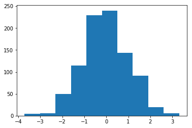

# SciPy


```python
import numpy as np
from scipy import io

a=np.arange(7)
io.savemat('a.mat',{'array':a})
#load a.mat
#a
#array
```

scipy.io.savemat(name,字典) 创建一个mat文件，俩参数：文件名 和 包含变量名和取值的字典。
load *.mat 加载mat文件
scipy的io模块 加载或者保存Matlab和Octive的矩阵和数组。


```python
from scipy import stats
import matplotlib.pyplot as plt
#生成随机数
generated = stats.norm.rvs(size=900)
#生成均值和标准差
stats.norm.fit(generated)
#偏度，面熟概率分布的偏斜程度
#返回两个值，第二个pvalue为数据服从正态分布的概率
stats.skewtest(generated)
#峰度检测
stats.kurtosistest(generated)
#正态检验
stats.normaltest(generated)
#得到某一百分比处的数值
stats.scoreatpercentile(generated,90)
#找到某一个数字所在区间的百分比
stats.percentileofscore(generated,1)
#直方图
plt.hist(generated)
plt.show()
```




